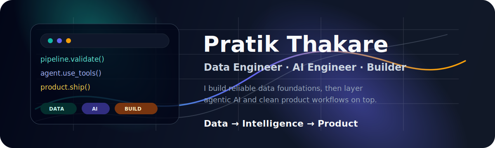
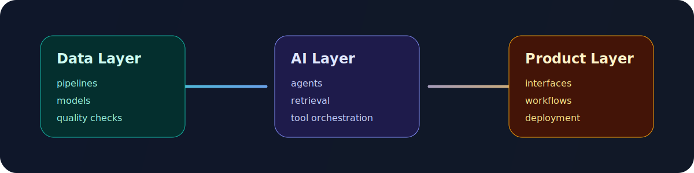
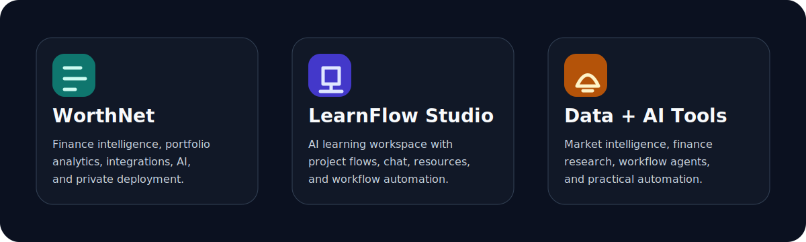
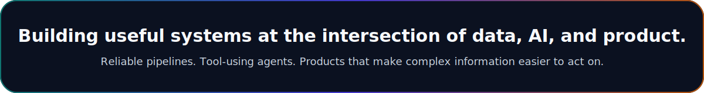

# Hi, I am Pratik Thakare

<p align="center">
  
</p>

<p align="center">
  <strong>WorthNet</strong> · <strong>LearnFlow Studio</strong> · <strong>Data Platforms</strong> · <strong>AI Agents</strong> · <strong>Product Engineering</strong>
</p>

---

## I Build Data + AI Products

I am a **Data Engineer + AI Engineer** who likes shipping complete products, not just notebooks or prototypes. My sweet spot is turning messy real-world data into reliable systems, then layering AI workflows on top so the product feels useful, explainable, and alive.

<p align="center">
  
</p>

## Builder Mode

```txt
01  Data foundations      ingestion, models, quality checks, analytics
02  AI systems            agents, RAG, tools, memory, model orchestration
03  Product engineering   Next.js, FastAPI, auth, UX, workflows, deployment
04  Operational polish    Docker, GitHub Actions, release flow, observability
```

## Featured Builds

<p align="center">
  
</p>

| Project | Signal |
| --- | --- |
| **WorthNet** | Personal/family finance operating system with portfolio analytics, integrations, AI assistance, and private deployment paths. |
| **LearnFlow Studio** | AI learning workspace with project flows, chat, resources, modern UX, and GitHub workflow automation. |
| **Data + AI Tools** | Experiments around market intelligence, finance research, workflow agents, and practical automation. |

## How I Think

- Build the boring data layer well so the AI layer can be trusted.
- Make sources, assumptions, and failure states visible.
- Prefer systems that are small enough to debug and strong enough to run.
- Turn repeated manual engineering work into documented automation.
- Ship end to end: backend, UI, auth, deployment, docs, and validation.

## Stack I Reach For

`Python` `TypeScript` `FastAPI` `Next.js` `Postgres` `SQLite` `Docker` `GitHub Actions` `LLM Agents` `Analytics`

## Current Direction

I am building toward a practical portfolio of AI-assisted products: finance intelligence, learning systems, data automation, and private tools that help people make better decisions from their own information.

<p align="center">
  
</p>
