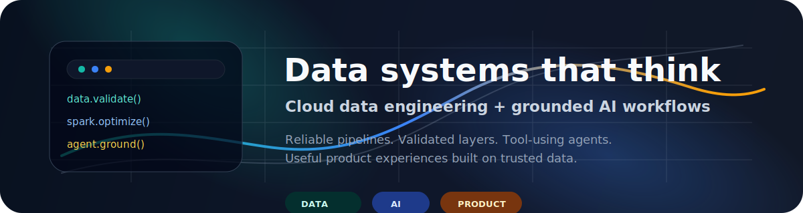

<p align="center">
  
</p>

<h1 align="center">Pratik Thakare</h1>

<p align="center">
  <b>Data Engineer</b> · <b>AI Engineer</b> · <b>Cloud Data Platforms</b>
</p>

<p align="center">
  I build reliable data foundations and grounded AI workflows for analytics, automation, and decision intelligence.
</p>

<p align="center">
  <code>GCP</code>
  <code>Spark</code>
  <code>Airflow</code>
  <code>BigQuery</code>
  <code>Snowflake</code>
  <code>Databricks</code>
  <code>LangChain</code>
  <code>LangGraph</code>
  <code>RAG</code>
  <code>MLflow</code>
</p>

---

### Focus Areas

<table>
  <tr>
    <td width="33%">
      <b>Cloud Data Engineering</b><br><br>
      Batch and streaming ingestion, orchestration, schema validation, CDC handling, lakehouse layers, and warehouse-ready datasets.
    </td>
    <td width="33%">
      <b>AI Engineering</b><br><br>
      Tool-using agents, retrieval workflows, context management, structured prompts, response guardrails, and LLM observability.
    </td>
    <td width="33%">
      <b>Product Mindset</b><br><br>
      Practical interfaces, reusable frameworks, Dockerized workflows, clean runbooks, and systems that are easy to operate.
    </td>
  </tr>
</table>

### Operating Model

```text
source systems -> governed ingestion -> Spark / SQL transformation
               -> validated lakehouse layers -> analytics + retrieval
               -> grounded AI workflows -> useful product experiences
```

### Signal

| Area | Evidence |
| --- | --- |
| Experience | 5+ years building and modernizing cloud data platforms |
| Performance | Up to 80% Spark performance improvement through optimization work |
| Automation | Around 50% reduction in manual DAG effort through reusable orchestration patterns |
| Data scope | Batch, streaming, CSV, Parquet, JSON, Avro, CDC, validation, auditability |
| AI scope | RAG, tool/function calling, context management, guardrails, MLflow tracking |

### Stack Map

| Layer | Tools and patterns |
| --- | --- |
| Orchestration | Apache Airflow, Cloud Composer, AWS MWAA, Azure Data Factory |
| Processing | Spark, PySpark, Scala, Spark SQL, Pandas |
| Data platforms | BigQuery, Snowflake, Databricks, Delta Lake, Iceberg |
| Cloud and storage | GCP, GCS, Pub/Sub, Dataproc, Dataflow, AWS S3 |
| AI engineering | LangChain, LangGraph, RAG, Vector DBs, Pinecone, tool/function calling |
| Reliability | MLflow, validation, observability, CI/CD, Docker, GitHub Actions |

### Direction

This GitHub is becoming a practical portfolio around data systems, AI workflows, and tools that grow into usable software. I care about clean foundations, grounded intelligence, and products that are calm to use and easy to maintain.
