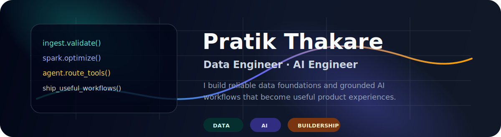

<p align="center">
  
</p>

<h2 align="center">Data Engineer by depth. AI Engineer by direction. Builder by habit.</h2>

<p align="center">
  <b>Cloud data platforms</b> · <b>Spark + Airflow</b> · <b>Lakehouse pipelines</b> · <b>Agentic AI workflows</b>
</p>

---

## What I am building toward

I work on the layer where data platforms become intelligent products: reliable ingestion, scalable processing, semantic retrieval, tool-using agents, and clean workflows that help people make better decisions.

<table>
  <tr>
    <td width="33%">
      <h3>Data Platforms</h3>
      <p>Ingestion frameworks, Spark pipelines, Medallion architecture, schema validation, CDC, orchestration, and warehouse-ready datasets.</p>
    </td>
    <td width="33%">
      <h3>AI Systems</h3>
      <p>LLM applications with tool routing, RAG, context management, structured outputs, guardrails, and observability.</p>
    </td>
    <td width="33%">
      <h3>Builder Mindset</h3>
      <p>Reusable frameworks, practical interfaces, Dockerized workflows, clear runbooks, and systems that can be debugged under pressure.</p>
    </td>
  </tr>
</table>

## My operating model

```txt
raw data
  -> governed ingestion
  -> Spark / SQL transformation
  -> validated lakehouse layers
  -> analytics, retrieval, and tools
  -> AI-assisted product workflows
```

## Proof points

- 5+ years building and modernizing cloud data platforms.
- Up to **80% Spark performance improvement** through optimization and framework-level improvements.
- Around **50% reduction in manual DAG development effort** through reusable orchestration patterns.
- Experience with batch, streaming, structured, and semi-structured ingestion across CSV, Parquet, JSON, and Avro.
- Hands-on AI engineering with agent workflows, tool/function calling, RAG patterns, MLflow tracking, and structured response guardrails.

## Current interests

<p>
  <code>agent-enabled analytics</code>
  <code>semantic retrieval</code>
  <code>enterprise AI assistants</code>
  <code>lakehouse architecture</code>
  <code>workflow automation</code>
  <code>LLM observability</code>
</p>

## Stack map

| Layer | Tools and patterns |
| --- | --- |
| Orchestration | Apache Airflow, Cloud Composer, AWS MWAA, Azure Data Factory |
| Processing | Spark, PySpark, Scala, Spark SQL, Pandas |
| Lakehouse and warehouse | BigQuery, Snowflake, Databricks, Delta Lake, Iceberg |
| Cloud and storage | GCP, GCS, Pub/Sub, Dataproc, Dataflow, AWS S3 |
| AI engineering | LangChain, LangGraph, RAG, Vector DBs, Pinecone, tool/function calling |
| Reliability | MLflow, validation, observability, CI/CD, Docker, GitHub Actions |

## Public work

This GitHub is becoming a portfolio of practical data and AI engineering work. Some repositories are experiments, some are products in progress, and some are references I learn from. The direction is simple: useful data systems, grounded AI workflows, and tools that grow into real software.

<p align="center">
  
</p>
