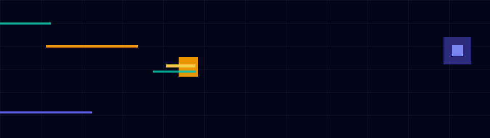

<h1 align="center">Hi, I am Pratik.</h1>

<p align="center">
  
</p>

<p align="center">
  <b>Data Engineer</b> · <b>AI Engineer</b> · <b>Builder</b>
</p>

<p align="center">
  <code>cloud data platforms</code>
  <code>spark</code>
  <code>airflow</code>
  <code>lakehouse</code>
  <code>rag</code>
  <code>agents</code>
</p>

---

## ├──📂 about

```yaml
name: Pratik Thakare
focus: Data Engineering + AI Engineering
experience: 5+ years
current_mode: building reliable data layers for intelligent products

interests:
  - cloud data platforms
  - spark and airflow modernization
  - lakehouse ingestion frameworks
  - agent-enabled analytics
  - retrieval and context engineering
  - grounded LLM workflows
```

## ├──📂 operating-system

```bash
> what_i_build
  raw_data -> governed_ingestion -> spark_transformations
           -> validated_lakehouse_layers -> analytics_tools
           -> ai_assisted_workflows

> engineering_bias
  data_quality_before_dashboards
  deterministic_tools_before_vague_ai_answers
  reusable_frameworks_over_pipeline_boilerplate
  observable_systems_over_hidden_magic
```

## ├──📂 proof-points

```txt
5+ years      building and modernizing cloud data platforms
80%           Spark performance improvement in optimization work
50%           reduction in manual DAG effort through reusable patterns
formats       CSV · Parquet · JSON · Avro
ai-workflows  RAG · tool calling · context management · guardrails · MLflow
```

## ├──📂 stack

| Layer | Tools |
| --- | --- |
| orchestration | Apache Airflow, Cloud Composer, AWS MWAA, Azure Data Factory |
| processing | Spark, PySpark, Scala, Spark SQL, Pandas |
| lakehouse | BigQuery, Snowflake, Databricks, Delta Lake, Iceberg |
| cloud | GCP, GCS, Pub/Sub, Dataproc, Dataflow, AWS S3 |
| ai | LangChain, LangGraph, RAG, Vector DBs, Pinecone, tool/function calling |
| reliability | MLflow, validation, observability, CI/CD, Docker, GitHub Actions |

## └──📂 public-work

This profile is still being shaped. I am keeping it focused on signal, not noise: practical data systems, grounded AI workflows, and tools that can grow into real software.

<p align="center">
  
</p>
